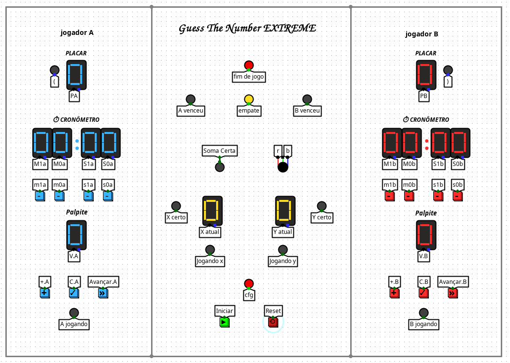
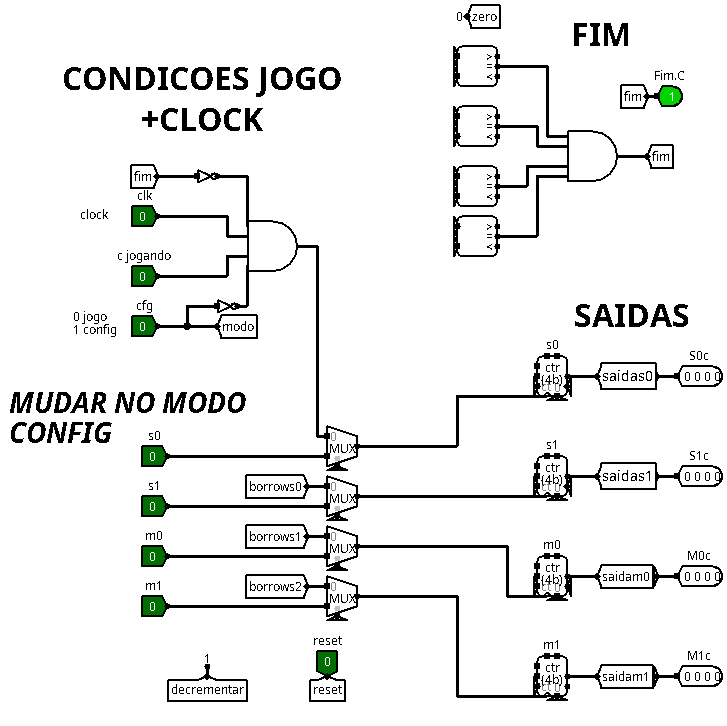
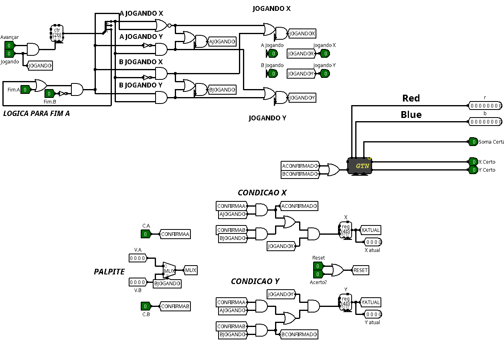
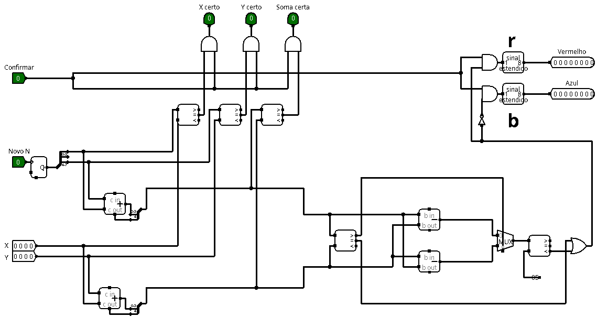

# Projeto: Guess The Number XTREME
**Data:** 10/08/2026  
**Disciplina:** Circuitos Digitais | **UFCA** - Universidade Federal do Cariri | **Professor:** Ramon Nepomuceno |

## Sobre o projeto
Jogo interativo desenvolvido no **Logisim** onde dois jogadores competem para adivinhar um ponto no espaço (coordenadas x e y), representadas por números de 4 bits aleatórios. O sistema retorna um feedback sobre a precisão dos palpites através de um sistema de "temperatura" (LEDs RGB: azul para frio, vermelho para quente) e indicação de acertos parciais ou totais. Ganha o jogador que acertar 15 coordenadas primeiro ou, caso nenhum jogador tenha atingido esse objetivo, aquele que tiver acumulado mais pontos quando ambos os tempos dos jogadores se esgotarem.
 
---
## Visão Geral

  
<a href="#circuito-main">Clique para abrir a visão geral do circuito</a>

   
  

    
  

  ## 📅 Desenvolvimento
| Data | Atividade |
| :--- | :--- |
| 08/07/2026 | Definição das especificações e estrutura do projeto |
| 11/08 ~ 16/08 | Implementação do circuito Cronômetro |
| 13/08 ~ 17/08 | Implementação do circuito GTN X |
| 17/08 ~ 20/08 | Implementação do circuito CORE |
| --/--/-- | Finalização da interface principal e entrega |

## * Circuitos principais:

### I. Cronômetro

* **Objetivo:** Realizar a contagem regressiva no turno do jogador.
   
* **Componentes:**
  * `4` Contadores.
  * `4` Multiplexadores (MUX).

* **Entradas (8 pinos):**
  * `Clk`: Sinal de clock do sistema.
  * `C jogando`: Pausa/ativa o cronômetro do jogador ativo (A ou B).
  * `s0` / `s1`: Ajustes de unidades (`s0`) e dezenas (`s1`) dos **segundos**.
  * `m0` / `m1`: Ajustes de unidades (`m0`) e dezenas (`m1`) dos **minutos**.
  * `reset`: Zera o cronômetro.
  * `cfg`: Alterna entre os modos de **Exibição** e **Configuração**.

* **Saídas:**
  * `Fim.C`: Informa que o jogador C zerou seu cronômetro.
  * `M0c` / `M1c`: Informa as dezenas (`M0c`) e unidades (`M1c`) de minuto do jogador C.
  * `S1c` / `S0c`: Informa as dezenas (`S1c`) e unidades (`S0c`) de segundo do jogador C.

* **Desafios:**
  * Noção de como funciona o contador
  * Controle dos limites de contagem de minutos e segundos.
  * Lógica e a estruturação do circuito

  
<a href="#cronometro">Clique para abrir a imagem do Cronômetro</a>

   
  
  

 
 

### II. Circuito CORE

* **Objetivo:** Atuar como o "cérebro do jogo, gerenciando os turnos dos jogadores e a validação de tempo e pontuação.

* **Componentes Principais:**
  * Contador para controlar turno e X/Y
  * Multiplexadores para seleção de palpites
  * Registradores para armazenarem os valores de X/Y
    
* **Entradas:**
  * `C.A` / `C.B`: Confirma chute de A/B
  * `V.A` / `V.B`: Valor do palpite de A/B
  * `Jogando`: Indica que o jogo está em andamento
  * `Fim.A` / `Fim.B`: Indica que o tempo de A/B acabou
  * `Avançar`: Avança a máquina de estado para o próximo estado
  * `Acerto`: Indica quando há um acerto (X e Y certos)
  * `Reset`: Reseta os registradores (e contador)

* **Saídas:**
  * `A jogando` / `B jogando`: Vez do jogador A/B
  * `X atual` / `Y atual`: Mostra o valor armazenado para o palpite de X/Y
  * `jogando X` / `jogando Y`: Indica que a coordenada que está sendo chutada é o X/Y

* **Desafios:**
* Implementação da lógica para "pular o turno" do jogador que ficar sem tempo (`Fim.A` / `Fim.B`)
* Onde relacionar o `Acerto` e `Reset`
* A lógica no geral para controle de turnos passagem de jogadores e coordenadas

  
<a href="#core">Clique para abrir a imagem do Circuito CORE</a>

   
  
  

 
 

 ### III. Circuito GTN X

* **Objetivo:** Circuito auxiliar integrado ao CORE. Ele implementa a geração dos números aleatórios e realiza as verificações de proximidade (temperatura) e acerto

* **Entradas:**
  * `Confirmar`: Verifica o resultado dos chutes submetidos
  * `Novo N`: Gera os novos números aleatórios X e Y

* **Saídas:**
  * `X certo` / `Y certo`: Verifica se a entrada X/Y é igual ao X/Y aleatório.
  * `Soma certa`: Verifica se a soma das entradas X e Y é igual à soma dos X e Y aleatórios.
  * `Temperatura`: Verifica o quão perto a soma de X e Y está da soma dos números aleatórios utilizando um LED RGB (quanto mais longe, mais azul; quanto mais perto, mais vermelho).

  
<a href="#gtnx">Clique para abrir a imagem do Circuito GTN X</a>

   
  
  

